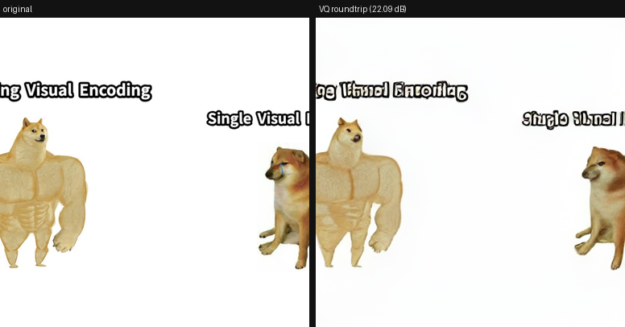

# JanusScribe

Multi-page illustrated documents on DeepSeek **Janus-Pro**, where the same
character or product looks the same in every image.

Janus-Pro has no subject consistency out of the box. Generate "a red fox in a
blue scarf" twice and you get two different foxes — here are the two this repo
actually produced at seeds 42 and 43, same prompt:

| seed 42 | seed 43 |
|---|---|
|  |  |
| different face, different eyes | different scarf, different pose |

That gap is the problem the later milestones close, by learning a soft token per
subject on the generation pathway.

**Status: M1 complete.** Primitives built and verified against the real model.
M2 has not started.

---

## Install

Requires Python 3.11 or 3.12 (see the `attrdict` note below for why not 3.13).

```bash
git clone https://github.com/deepseek-ai/Janus vendor/Janus
uv venv --python 3.11 .venv
uv pip install "torch>=2.4,<3" --index-url https://download.pytorch.org/whl/cpu  # or the CUDA index
uv pip install -e .
uv pip install -e ./vendor/Janus --no-deps
```

The `--no-deps` on the vendored package is **not optional**. Janus depends on
`attrdict`, which imports `collections.Mapping` and therefore cannot be
installed on Python 3.10 or later. This project depends on `attrdict3` instead,
a maintained fork that patches the import. Installing Janus with its own
dependencies will break the environment. Full reasoning in
[NOTES-API.md](NOTES-API.md) §7.

`flash-attn` is optional. It is never required, and a missing install falls back
to `sdpa` with one warning:

```bash
uv pip install -e ".[flash]"   # only useful on CUDA with fp16/bf16
```

Weights download automatically on first use (~3.9 GB for Janus-Pro-1B):

```bash
januscribe info
```

---

## Use

```bash
januscribe gen "a red fox wearing a navy blue scarf, digital art" --seed 42 -n 2
januscribe ask outputs/gen/img_seed42.png "what colour is the fox?"
januscribe vq-roundtrip assets/doge.png --out outputs/vq/doge_roundtrip.png
januscribe repl                       # load the model once, run many commands
```

Model, device and dtype are configuration, never hardcoded:

```bash
januscribe --config configs/cuda-7b.yaml gen "..." --seed 42
januscribe --model deepseek-ai/Janus-Pro-7B --device cuda --dtype bfloat16 info
JANUSCRIBE_MODEL_ID=deepseek-ai/Janus-Pro-7B januscribe info
```

`--device` accepts `auto`, `cuda`, `mps` and `cpu`. MPS and CPU work and are
slow; neither crashes.

---

## What M1 proves

| Deliverable | Evidence |
|---|---|
| Real API surface documented, assumptions corrected | [NOTES-API.md](NOTES-API.md) |
| Text to image with CFG, seeds, batching | [docs/m1/fox_seed42.png](docs/m1/fox_seed42.png), [fox_seed43.png](docs/m1/fox_seed43.png) |
| Identical seed gives identical output | `tests/test_generation_determinism.py` |
| Image plus question to text | `januscribe ask` — verified on the generated foxes |
| VQ encode to 576 ints and back | [docs/m1/vq_doge_roundtrip.png](docs/m1/vq_doge_roundtrip.png), **22.09 dB** |
| Roundtrip guarded by a test | `tests/test_vq_roundtrip.py`, floor 17 dB |

The VQ encode path is the load-bearing one: M3's textual inversion turns
reference images into teacher-forcing targets, and that only works because
`gen_vision_model.encode` recovers the same code space the model generates in.



Left: original. Right: 576 codes decoded back. Fur, colour and silhouette
survive; small glyphs do not, which is the correct signature of a 16x-downsample
VQ rather than a pipeline that is secretly passing pixels through.

### Determinism, and one deliberate deviation

The upstream sampling loop draws one batched `torch.multinomial` per step, so
which pixels you get for image *i* depends on how many images you asked for.
JanusScribe gives each row its own generator seeded `base_seed + i` and samples
row by row, so image *i* is byte-identical whether sampled alone or in a batch
of eight. Ablation runs across different batch sizes are not comparable
otherwise. Determinism holds per `(seed, device, dtype)`, not across devices.

One measured caveat, found by the test suite rather than assumed: the VQ
**decoder** is not bit-exact between batch size 1 and batch size > 1 on CPU --
4 subpixels of 442368 move by one level (98.6 dB). Sampled tokens are identical
regardless; only the rendered PNG bytes shift. Compare images by score, never by
file hash. Details in [NOTES-API.md](NOTES-API.md) §5.

---

## Testing

```bash
pytest -m "not slow"     # 24 tests, ~16 s, no weights needed
pytest -m slow           # needs weights; hours on CPU, minutes on CUDA
```

The model is never mocked. Tests that need it are marked `slow` and **skip with
an explicit reason** when the weights are absent, so a green run on a machine
with no weights cannot be mistaken for a green run that exercised the model.

---

## Layout

```
src/januscribe/
  config.py      pydantic settings, YAML profiles, device/dtype resolution
  logging.py     structlog setup
  seeding.py     every RNG seeded from one place; per-row generators
  cache.py       KV cache construction, isolated from the sampling loop
  model.py       load once, hold in a singleton; flash-attn detection
  generate.py    text to image: CFG sampling, seeds, batched parallel_size
  understand.py  image plus question to text, plus strict yes/no parsing
  vq.py          image <-> 576 VQ tokens, with PSNR
  subjects.py    Subject registry: canonical description, attributes, seeds, refs
  consistency.py attribute rubric + SigLIP similarity, reported separately
  baseline.py    resumable Tier 0 runner behind a pluggable PromptStrategy
  cli.py         typer CLI
configs/         default.yaml, cuda-7b.yaml, subjects.yaml, scenes.yaml
tests/           fast unit tests plus slow model-backed tests
NOTES-API.md     the verified Janus-Pro API surface
```

---

## Roadmap

- **M1 — primitives.** Done.
- **M2 — subject registry, Tier 0 baseline.** Over-specified canonical
  descriptions plus fixed seeds; attribute rubric and SigLIP embedding
  similarity reported separately, never collapsed into one number.
- **M3 — textual inversion on the generation pathway.** One new row in the LM
  text embedding table, everything else frozen. See NOTES-API.md §4 — the model
  has two input embedding tables and putting the soft token in the wrong one
  fails silently.
- **M4 — LoRA variant, visual self-conditioning, retry loop.**
- **M5 — document pipeline** with a pluggable planner.
- **M6 — eval harness.** The comparison table is the actual output of the
  project.

## Hardware note

This was built and verified on a CPU-only laptop: generation costs ~180 s per
384px image, so the M2 baseline (60 images plus rubric scoring) is roughly a
seven-hour run here and the M6 sweep needs a CUDA box. Nothing in the code
assumes a GPU, but the schedule should.

## Licences

Janus code is MIT. Janus-Pro **weights** are under the DeepSeek Model License,
which is not MIT — check it before shipping anything built on them.
`assets/doge.png` is copied from the upstream Janus repo.
